# Flashbot's MEV-Share CTF Solution/Client in Rust

## How It Works

Ayo all this thing do is listen for flashbot event from sse and block from rpc, execute all predefined condition check in parallel, and check for final tx in block then mark that condition as completed.

```mermaid
  gantt
  title Client Diagram
  dateFormat X
  axisFormat %s
  section Block Event
  Block 1           :milestone, 0,
  Block 2           :milestone, b2, 4,
  Add Tx1 To Processed :crit, after b2, 1s
  section Flashbot SSE Event
  Receieved Tx1     :tx1, 1, 1s
  Receieved Tx2     :tx2, 1, 1s
  Receieved Tx3     :tx3, 1, 1s
  Processing Tx1     :ptx1, after tx1, 1s
  Processing Tx2     :ptx2, after tx2, 1s
  Processing Tx3     :after tx3, 1s
  Sending Bundle With Tx1 :active, after ptx1, 1s
  Sending Bundle With Tx2 :after ptx2, 1s
```

**Note:** Although it does condition check in parallel but it doesn't handle incremental nonce yet.

## Instruction

Put your private key and rpc endpoint in `.env`, run the executatble with `cargo run`, and then gucci.
